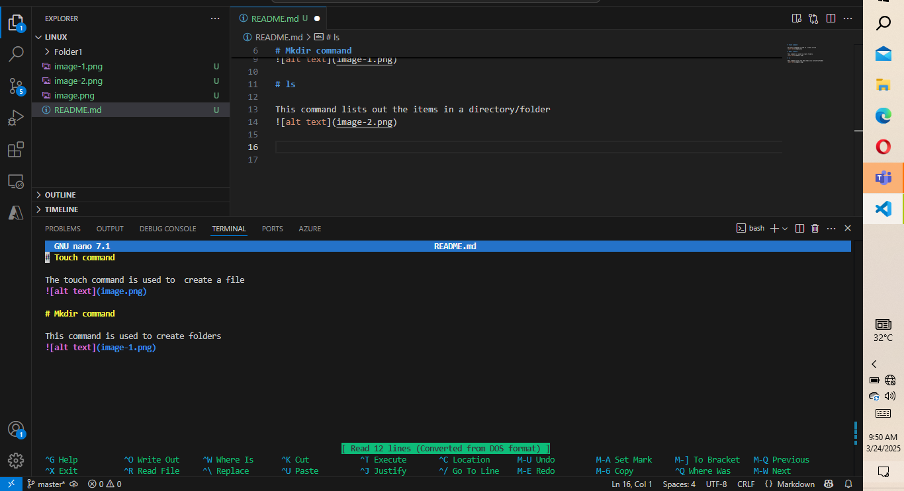

# Touch command

The touch command is used to  create a file

# Mkdir command

This command is used to create folders

# ls

This command lists out the items in a directory/folder

# Nano command

This is a text editor command, it can be used to edit the content of a file

- tHE Text editor screenshot

# cd

This command is used to navigate in between folders. in the screenshot below, we navigated into the folder we created.

# cd ..
This command takes you to the root directory. According to the screenshot , we used his command go back to our root directory in which we are working in which is linux.
# pwd 
In this same screenshot, we also used the pwd command which means print working directory. This command shows the current directory we are working in.

# rm 
This command is used to remove files from a directory. in the screenshot below, we created a file with the touch command and also removed the file with the remove command.

# rmdir
This command is used to delete a folder/directory. In this screenshot, we created a new folder called folder 2 with the mkdir command and deleted it rmdir command

